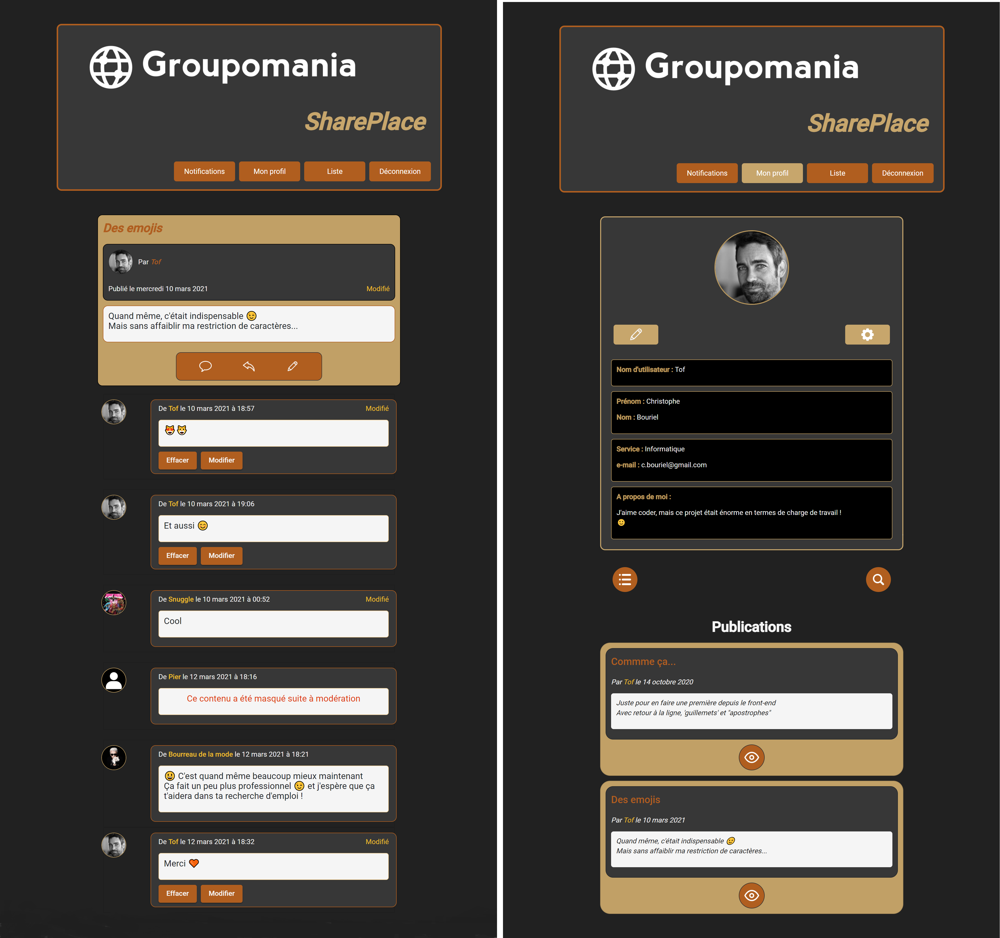

# À propos :
* [Le projet](#Le-projet)
* [Ce repository](#Ce-repository)

## Le projet :

Partant sur la base de mon dernier projet de formation, pour lequel on me demandait de réaliser le MVP d'un réseau social d'entreprise – voir mon [portfolio](https://portfolio-christophe-bouriel.netlify.app/#projet-5) – j'ai décidé de continuer à le développer afin de pratiquer, d'intégrer peu à peu des connaissances qui me manquent encore... et parce que je suis curieux et que j'aime coder !  

Le site a été déployé en utilisant les services cloud suivant : Netlify pour ce front-end, Heroku pour le back-end, Cloudinary pour stocker les images car le précédent ne me permet pas de conserver les fichiers créés entre deux démarrages, et enfin ClearDB pour la base de données MySQL. Vous pouvez y accéder en cliquant [ici](https://shareplace-evo.netlify.app)

On peut également accéder au repository pour faire fonctionner l'application avec Docker en cliquant [ici](https://github.com/ChristopheBouriel/SharePlace-Evo-Docker). Toutes les informations sont dans le README, notamment les noms d'utilisateur et mots de passe pour se connecter sans avoir à créer de profil ou essayer le mode « Modérateur » – lors de la création du container MySQL, des données sont insérées pour permettre une démonstration immédiate.  

Les fonctionnalités déjà implémentées sont détaillée dans ce document [wiki](../../wiki/SharePlace notice).

Liste prévisionnelle des ajouts à venir :

* implémentation d'une fonctionnalité "Like" pour les publications puis peut-être les commentaires
* ancres lors du retour à la liste depuis une publication pour éviter de revenir au sommet
* amélioration de la fenêtre de recherche d'un utilisateur – correspondance partielle et suggestions
* afficher le nombre de notifications dans le bouton du menu, sous forme de badge
* publication de photos, gifs, vidéos...
* réinitialisation du mot de passe
* utliser le lazy loading
* amélioration des fonctionnalités de modération – au moins permettre de gérer individuellement la conservation ou l'effacement des notifications concernant chaque publication ou commentaire, au lieu de n'avoir que la liste entre deux connections, renouvellée à chaque fois
* permettre de répondre directement à un commentaire 

Vous pourrez trouvez plus d'informations sur le projet initial et cette version améliorée en consultant mon portfolio :
https://portfolio-christophe-bouriel.netlify.app  

# Ce repository :

Ce repository concerne le front-end de l'application, développé avec [Angular CLI](https://github.com/angular/angular-cli) version 10.0.5, et vous pouvez trouver le back-end développé avec Node.js et Express en suivant [ce lien](https://github.com/ChristopheBouriel/SharePlace-Evolution-API.git).  

Pour le lancer sur votre ordinateur, après avoir démarré l'API mentionnée ci-dessus, suivez les instructions suivantes :
1. Cloner le repository :  
	`git clone https://github.com/ChristopheBouriel/SharePlace-Evolution-UI.git`
2. Entrer dans le répertoire racine du projet :  
	`cd SharePlace-Evolution-UI.git`
3. Lancer le serveur Angular :  
	`ng serve`

Vous pouvez alors vous rendre à l'adresse `http://localhost:4200/` sur votre navigateur.
